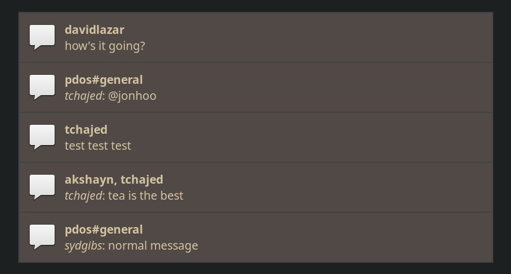

[Keybase](https://keybase.io/) comes in a few flavors: as a command-line
tool, a browser extension, and as a "standalone" [Electron
application](https://github.com/electron/electron). Chances are you are
using the latter of these if you have a nice GUI for your keybase chats.
However, there are a few reasons why you may not want to install the
Electron version. First, it comes with a full bundled browser (which may
also be outdated). Second, it's a pretty heavy-weight solution if you
just want to keep on top of messages. And finally, it requires that you
keep another application running on your desktop, which can get messy
quickly. How many chat applications do you have running already?

This application aims to provide you with another lightweight
alternative. It uses the `keybase chat api-listen` command to watch for
incoming messages, massages and filters them a bit, and then sends them
to your favorite operating system notification daemon for display. How
you then choose to view the messages is up to you. Personally, I'll then
just use the command-line `keybase chat` command, but whatever floats
your boat.

To install the tool, make sure you have a somewhat recent Rust compiler
[installed](https://www.rust-lang.org/tools/install) and `~/.cargo/bin`
in your `$PATH`. Then run:

```console
$ cargo install keybase-chat-notifier
$ keybase chat api-listen | keybase-chat-notifier
```

If you want a local checkout instead, run:

```console
$ git clone https://github.com/jonhoo/keybase-chat-notifier.git
$ cd keybase-chat-notifier
$ keybase chat api-listen | cargo run
```

### Customization

Very limited at the moment. The appearance of the notifications is
mostly controlled by whatever your notification system does. You can use
`--icon` to choose which icon is used for the notifications (macOS
probably ignores that though). You can also use `--me` to set which
username "you" are considered to have for the purposes of filtering out
your own messages (if not set, the tool uses `keybase status`).

The notifications on my machine look like this:



Happy to review PRs for additional features should you think of one you
wish to see.
